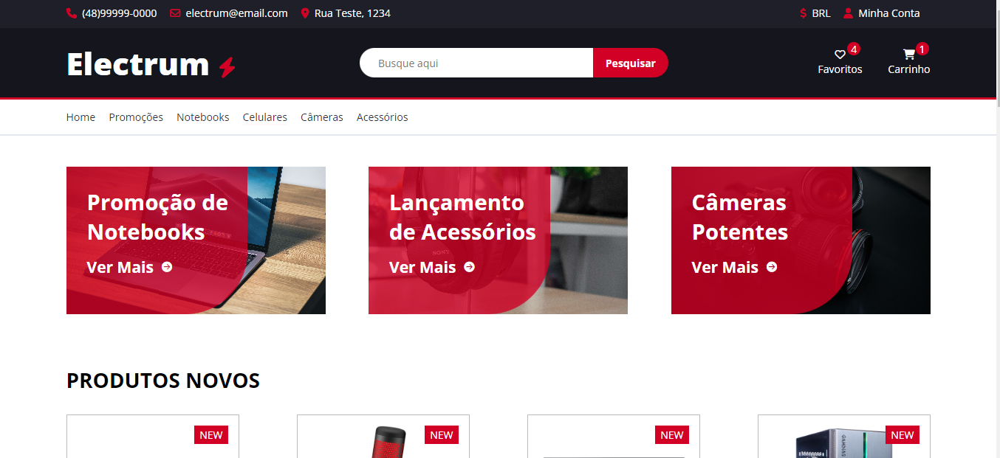
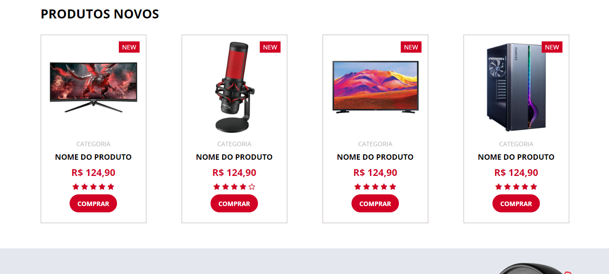
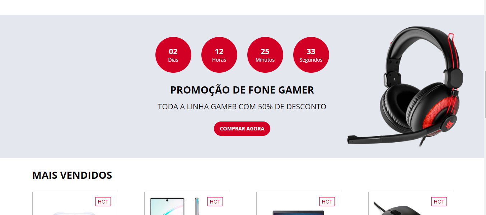
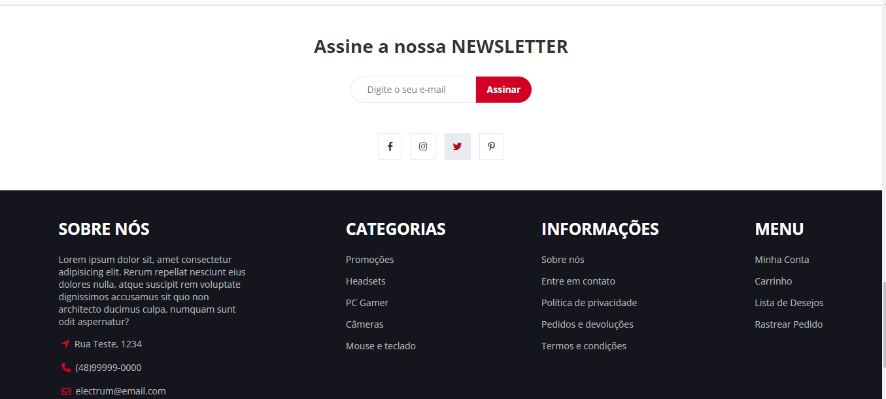
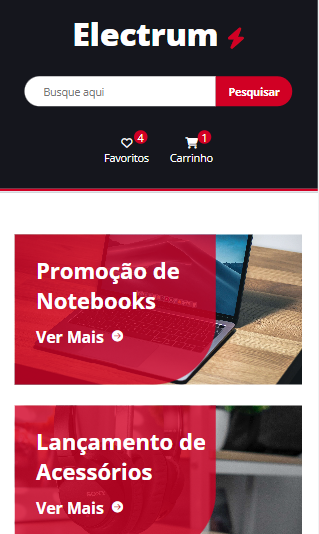

# Electrum ⚡

Electrum, site de vendas de produtos / e-commerce

  
  
  
  
  

  

## Tecnologias utilizadas no projeto 💻

### `HTML` 📄

### `SASS` 🎨

* Nested
* Placeholder Selectors
* Mixins
* Partials
* Arquitetura SMACSS
* Variables

### `Google Fonts` 🎨

* Open Sans Font

### `Font Awesome` 🎨

* Ferramenta de ícones estilizáveis
